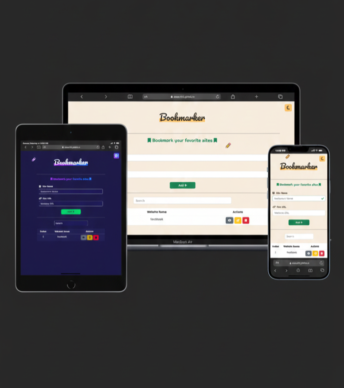

# 🔖 Bookmark Keeper

A simple website that allow you save and manage website bookmarks by entering site names and URLs of it.
---

## 💡 Key Features and JavaScript Logic:

🔸 Add, edit, delete, and view bookmarks (full CRUD functionality)
🔸 Store and retrieve bookmarked sites using LocalStorage for persistent data
🔸 Real-time, case-insensitive search to quickly find saved websites
🔸 Real-time input validation using Regex for site names and URLs with instant visual feedback
🔸 Custom validation modal to clearly guide users when inputs are invalid
🔸 Light / Dark mode toggle to enhance accessibility and user preference
🔸 Clean, responsive UI built with Bootstrap
🔸 Custom animated pencil cursor to boost interactivity and user engagement

---

## 🛠️ Tech Stack

- **HTML5**  
- **CSS3**  
- **Bootstrap 5**  
- **Responsive Design**
- **JavaScript (DOM manipulation, Event handling, LocalStorage, Regex Validation)**  
- **Google Fonts**  
- **Font Awesome**

---

## 💻 GitHub Repo & Live Demo

🔗 **GitHub Repo:** [Bookmark Keeper](https://github.com/Doaa182/Bookmark-Keeper/)  
🌐 **Live Demo:** [View on GitHub Pages](https://doaa182.github.io/Bookmark-Keeper/)

---

## 👩‍💻 Author

**Doaa Diaa El Din**  
🔗 [GitHub Profile](https://github.com/Doaa182)

---
## 📸 Screenshot
 

